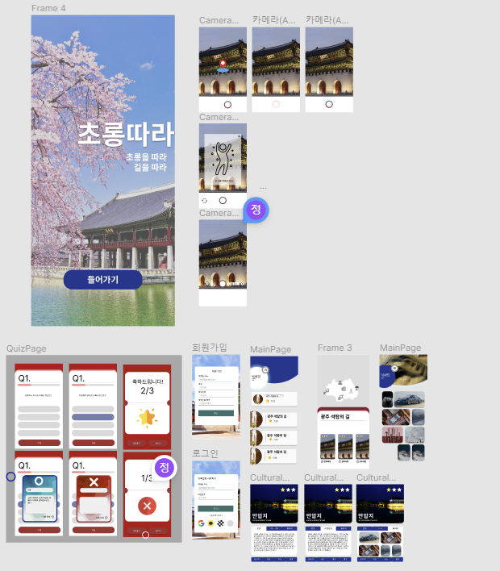
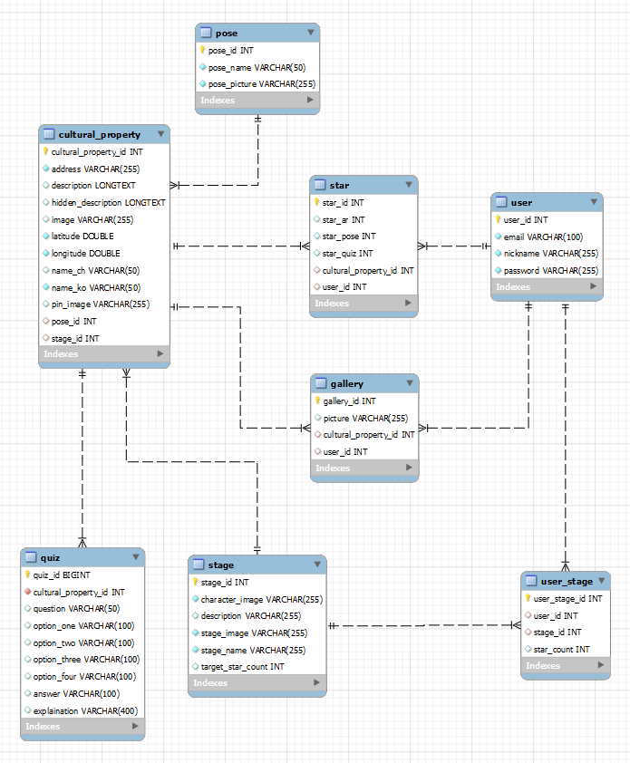

# 📢 초롱따라

> ## 주제  
>
> ChatGPT를 활용한 문화재 퀴즈/Teachable Machine을 활용한 포즈 사진 찍기/AR 기술을 활용한 문화재 게임을 통한 **문화재 탐방 서비스**입니다.
>
> 
2023.02.20 ~ 2023.04.07 (7주)

  

> ## **팀원소개**
> - #### BE(2명) FE(2명) Android(1명)

| 양동민  | 백지원  | 최유경 | 최지성 | 정원재 |
| :----: | :----: | :-----: | :----: | :----: | 
| 👑 FE  |   FE   | Android |   BE   |   BE   |

 

## 🛠️ 기술 스택 및 환경
#### **BackEnd**
- Springboot 2.7.9
- Java 11
- Gradle 7.6.1
- Mysql 8.0.32

#### **FrontEnd**
- typescript
- Node 16.18.0
- React 18.2.0
- Redux
- React-query
- tailwind
- Styled-components

#### **Android**
- Android 13
- API 33
- google.ar:core:1.35.0

#### **CI/CD**
- AWS EC2 (Ubuntu 20.04 LTS)
- Docker 23.0.1
- Jenkins 2.387.1
- nginx/1.18.0 

#### **Communication Tools**
- Git
- Jira
- notion
- Mattermost

 

> ## ✔️ 디자인 프로토타입

> ## ✔️ ERD

 

> ## **기능 소개**

### **메인페이지(회원가입 및 로그인)**

👀 벗꽃이 휘날리는 애니메이션이 들어간 메인페이지를 구성하였습니다. 또한 메인페이지에서 회원가입 및 로그인 기능을 구현 하였습니다. 
 

 

    
 

