# 📢 초롱따라

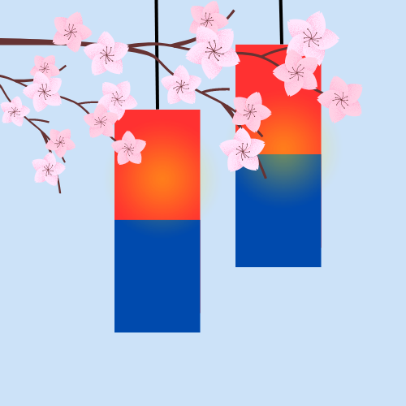

  

> ## 주제  
>
> [개요] 온/오프라인 병행가능한 언어치료 수업 플랫폼
>  
> ChatGPT를 활용한 문화재 퀴즈/Teachable Machine을 활용한 포즈 사진 찍기/AR 기술을 활용한 문화재 게임을 통한 **문화재 탐방 서비스**입니다.
>   [기간] 2023.02.20 ~ 2023.04.07 (7주)
>   [성과] 우수 프로젝트에 선정되어 우수상 수상

  

> ## **팀원소개**
>
> - #### BE(2명) FE(2명) Android(1명)

| 양동민 | 백지원 | 최유경  | 최지성 | 정원재 |
| :----: | :----: | :-----: | :----: | :----: |
| 👑 FE  |   FE   | Android |   BE   |   BE   |

 

## 🛠️ 기술 스택 및 환경

#### **BackEnd**

- Springboot 2.7.9
- Java 11
- Gradle 7.6.1
- Mysql 8.0.32

#### **FrontEnd**

- typescript
- Node 16.18.0
- React 18.2.0

#### **Android**

- Android 13
- API 33

#### **CI/CD**

- AWS EC2 (Ubuntu 20.04 LTS)
- Docker 23.0.1
- Jenkins 2.387.1
- nginx/1.18.0

#### **Communication Tools**

- Git
- Jira
- notion
- Mattermost

 

> ## ✔️ 디자인 프로토타입
>
> 

 

> ## ✔️ ERD

 

> ## **기능 소개**

### **메인페이지(회원가입 및 로그인)**

👀 벗꽃이 휘날리는 애니메이션이 들어간 메인페이지를 구성하였습니다. 또한 메인페이지에서 회원가입 및 로그인 기능을 구현 하였습니다.

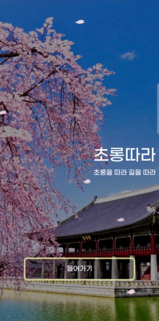

 

### **스테이지 페이지**

👀 스테이지 페이지에서 스테이지 별 획득한 별의 갯수를 파악할 수 있으며 스테이지의 모든 별을 획득하였을 시, 지역별 마스코트 스티커를 획득 할 수 있습니다.

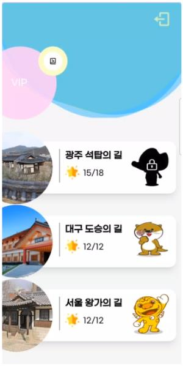

 

### **지도 페이지**

👀 leaflet 라이브러리를 활용하여 QGIS로 생성한 geojson파일로 지도와 좌표별 핀의 위치를 표현 하였습니다.

 

### **상세 페이지**

👀 문화별 상세 정보를 확인 가능하고 문화재 근처에서 찍은 사진이 저장 가능한 페이지를 구성하였습니다.

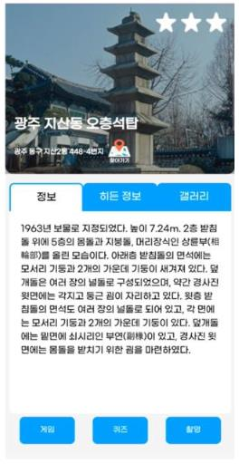

 

### **길찾기**

👀 문화재 반경 500m안에서 문화재까지 찾아가는 기능을 AR로 표현 하였습니다.

 

### **AR게임**

👀 문화재 반경 50M이내로 접근시 AR로 별 찾기 게임 기능을 구현 하였습니다.

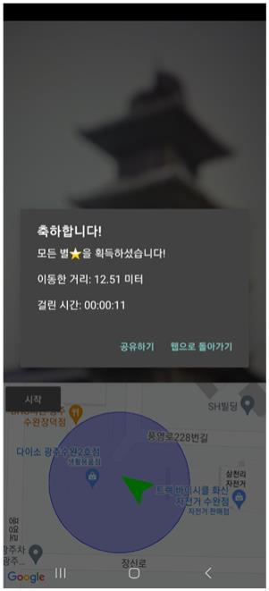

 

### **퀴즈**

👀 ChatGpt를 활용하여 ChatGpt가 내주는 문화재에 대한 관련 퀴즈를 풀 수 있는 기능을 구현 하였습니다.

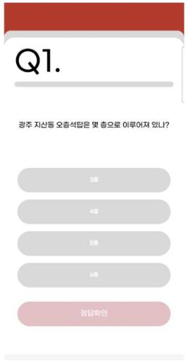
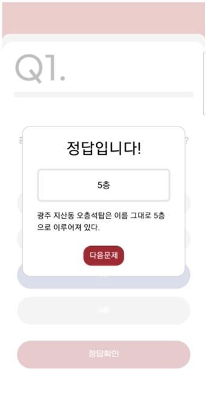
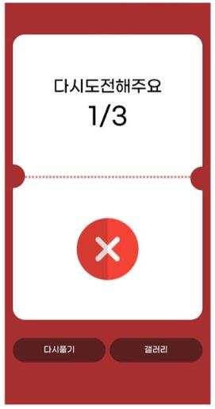
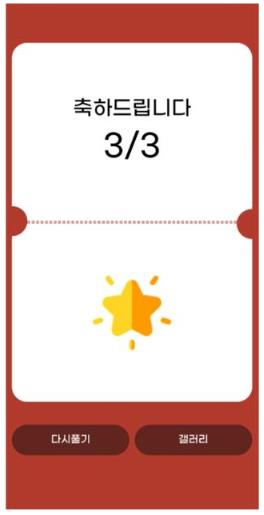

 

### **포즈 인식**

👀 Teachable Muchine을 활용하여 주어진 포즈와 같은 포즈를 취했을 때 사진이 저장되는 기능을 구현 하였습니다.

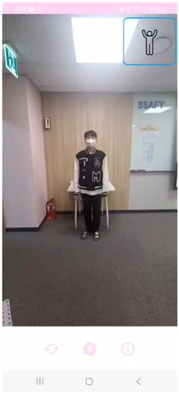
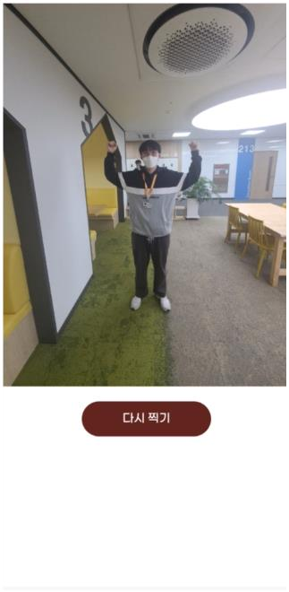
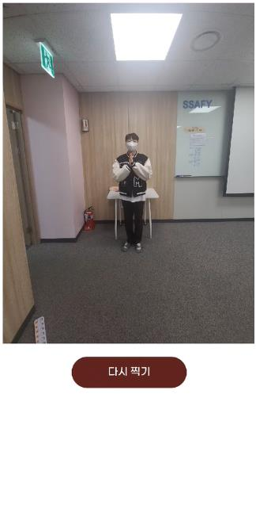

 

> ## 기대효과

### 🎉 문화재 인식 향상  

다양한 문화 교육 및 정보 제공을 통해 문화재 인식이 향상 될 수 있습니다.

### 🎉 게이미피케이션을 통한 역사 교육

AR 게임/문화재 퀴즈풀기/포즈인식 사진찍기를 통해 역사 교육이 가능합니다.

### 🎉 관광산업 활성화

문화재 기반 다양한 게임 기능을 통해 문화재 여행을 증가시켜 지역 경제를 활성화 할 수 있습니다.
